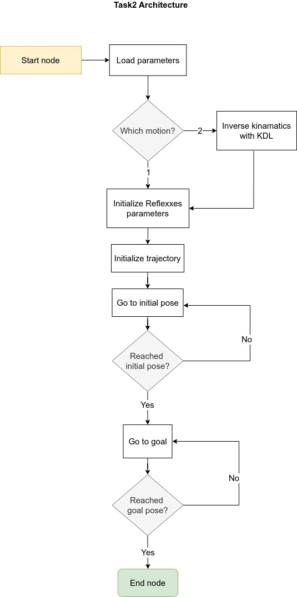

# UR5-Tasks


## How to setup:
This project is using ROS1 (noetic) on Ubuntu 20.04.  
Inside src folder:
```
git clone https://github.com/eslamsalahelsheikh/ur5_tasks.git
sudo apt-get install ros-kinetic-universal-robot
```
build the project and source the files:
```
catkin_make
source devel/setup.bash
```

## How to run the tasks:

## Task1

It runs python script that keeps sending sinosuidal wave to each joint one after the other, and it keeps on looping until you end it.  
### To run the task:
```
roslaunch ur5_tasks task1.launch
```


## Task2
This task is a C++ program that has option to run two motions:
1. Joint motion between 2 points in joint space.
2. Linear motion between 2 poses in cartesian space

To specify the motion type and configuration for each motion, you can edit the parameters in this [file](https://github.com/eslamsalahelsheikh/ur5_tasks/blob/main/config/params.yaml).  
### Architecture  
The architecture is as follows:  



### To run the second task:
```
roslaunch ur5_tasks task2.launch
```

